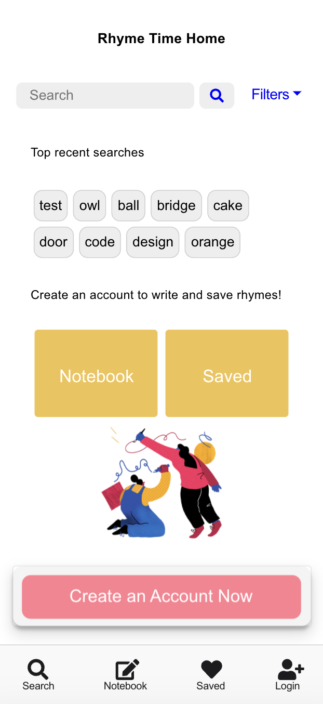
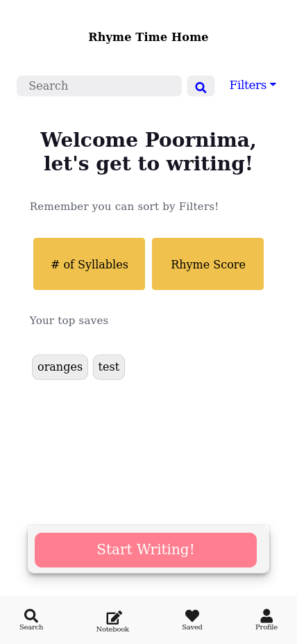
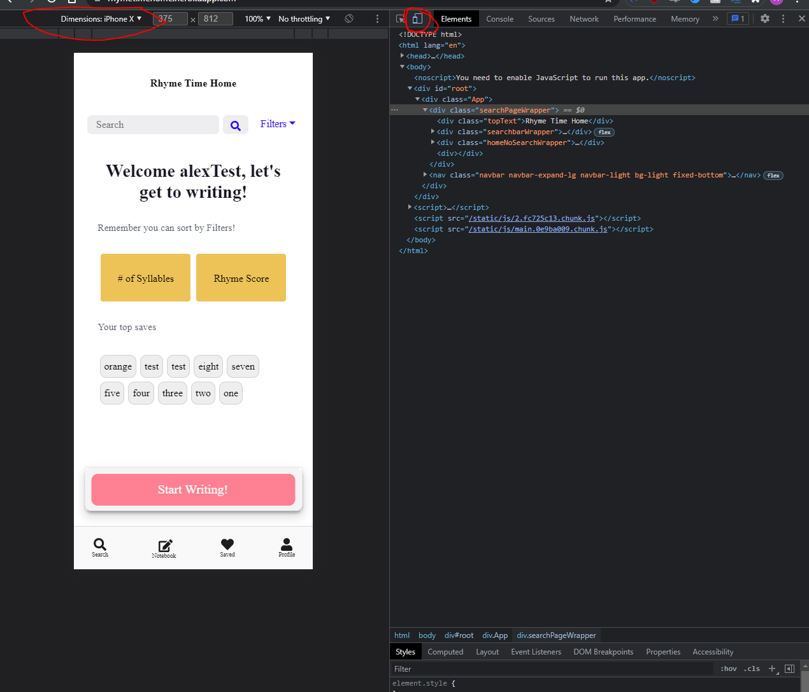

# Rhyme Time

A social, mobile-first application that makes poets out of everyone! Users enter a word and the application returns all words that rhyme with it and helps pick the best one.

Hopefully the words have jogged your imagination in which case you can write your thoughts down into a convenient Notebook.

##  How to play

** Note that this website is best viewed on mobile devices! **
This was developed with mobile first in mind so when viewing - please ** right click on the page and select 'inspect', then click the button in the top left of the inspector box as displayed in the linked photo ** 

Broadly, you can use this application in two roles:

1. Logged-in users can utilize the full functionality of the website - finding rhymes and saved notebooks.
2. Non logged-in users can only use the rhyme finder.

### Technologies Used
- HTML
-  CSS 
-  ReactJS
- Express Node.js
- MongoDB
-  REST APIs
  -- https://rhymebrain.com/
-  Json Web Token Authentication
 
### Getting Started:
Website: https://rhymetimehome.herokuapp.com/

TestResponsive Website:https://www.responsinator.com/?url=https%3A%2F%2Frhymetimehome.herokuapp.com%2F

### Icebox Items:
- CSS styling for Screen size greater than 600px
- Implement authentication with OAuth
- Making a active interface with the writing page and word saved page

### Reference:
* FontAwesome Icons
* Bootstrap

